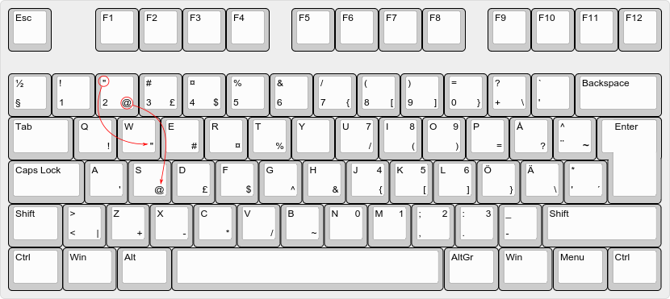

Swedish coder keyboard layout
=============================

Varför en ny layout?
--------------------

Den svenska standarden för tangentbord som bygger på qwerty-layouten är väldigt 
dåligt anpassad för den som vill programmera. Många av de symboler som används 
frekvent bygger på att man får göra onaturliga kombinationer av `Alt Gr` eller 
`Shift` och siffertangenterna.

En del väljer att byta till en engelsk tangentbordslayout eller andra svenska 
varianter, men det har sina baksidor. Förutom att behöva lära sig en helt ny 
layout blir tangentbordet oanvändbart för den oinvigde.

Fördelarna med den här layouten är framförallt följande:

* Den går fortfarande att använda precis som ett vanligt svenskt 
  qwerty-tangentbord.
* Istället för att lägga alla symboler på siffertangenterna flyttas de ner till 
  bokstavstangenterna, vilket gör de betydligt mer lättåtkomliga.
* De flesta qwerty-tangentbord har markerat ut var symbolerna ligger, vilket kan 
  användas som en kom-ihåg även för den här layouten.

Layouten i bild
---------------

På varje tangent i bilden finns det plats för fyra symboler, dessa ska förstås 
såhär:

    1  4
    
    2  3

1. `Shift` + `tangent`
2. Bara `tangent` (Har uteslutits i bilden på bokstavstangenterna)
3. `Alt Gr` + `tangent`
4. `Shift` + `Alt Gr` + `tangent`

De röda och blå symbolerna är vad som skiljer den här layouten mot en vanlig 
klassisk qwerty-layout. De röda symbolerna är alltså `Alt Gr` + `tangent`, medan 
de blå är `Alt Gr` + `Shift` + `tangent`.

Förklaring av logiken
---------------------

Förutom att alla symboler och bokstäver går att komma åt precis som tidigare, 
finns de nu även nerflyttade till bokstäverna rakt under motsvarande siffra. För 
att skriva symbolerna används `Alt Gr`. Första raden nedanför används för de 
symboler som man annars skriver genom att hålla nere `Shift` när man trycker på 
siffran. (`w` ligger på första raden under `2`, och används här för att skriva 
`"`). Andra raden nedanför siffran innehåller de symboler som man annars kommer 
åt genom att hålla in `Alt Gr` tillsammans med siffran. (`s` ligger två rader 
nedanför `2` och används här för att skriva `@`). Skulle du glömma var 
symbolerna finns kan du därför enkelt kolla på siffran `2` för att se var de 
gömmer sig.

Utöver dessa symboler finns det ett antal till som är användbara, t.ex. `+-*/` 
som är lagda på `zxcv`. Det finns också en hel numpad lättillgänglig om man 
håller in `Shift` + `Alt Gr` + `uiojklnm,.`. 

Installation
------------

För tillfället finns layouten bara till Linux/Ubuntu, men du får gärna göra den 
tillgänglig till andra operativsystem med, så länge den förblir öppen källkod 
(se [LICENSE](LICENSE) för mer information). 

### Ubuntu

För att installera layouten i Ubuntu kopierar du texten i filen 
[layout.txt](layout.txt) och klistrar in i `/usr/share/X11/xkb/symbols/se`. Efter det behöver du lägga till den som ett alternativ i `/usr/share/X11/xkb/rules/evdev.xml`. Leta upp sektionen som liknar denna:

    <layout>
      <configItem>
        <name>se</name>
        <shortDescription>sv</shortDescription>
        <description>Swedish</description>
        <languageList>
          <iso639Id>swe</iso639Id>
        </languageList>
      </configItem>
      <variantList>
        <variant>
          <configItem>
            <name>nodeadkeys</name>
            <description>Swedish (eliminate dead keys)</description>
          </configItem>
        </variant>

lägg till den nya layouten, så att filen ser ut såhär:

    <layout>
      <configItem>
        <name>se</name>
        <shortDescription>sv</shortDescription>
        <description>Swedish</description>
        <languageList>
          <iso639Id>swe</iso639Id>
        </languageList>
      </configItem>
      <variantList>
        <variant>
          <configItem>
            <name>nodeadkeys</name>
            <description>Swedish (eliminate dead keys)</description>
          </configItem>
        </variant>
        <variant>
          <configItem>
            <name>coder</name>
            <description>Swedish (Coder)</description>
          </configItem>
        </variant>

Kör sedan kommandot `sudo dpkg-reconfigure xkb-data` för att uppdatera cachen. Du 
kan nu välja layouten i `Systeminställningar -> Tangentbord -> Textinmatning`.

Samma princip borde gälla alla Linux-distributioner som använder X11.
